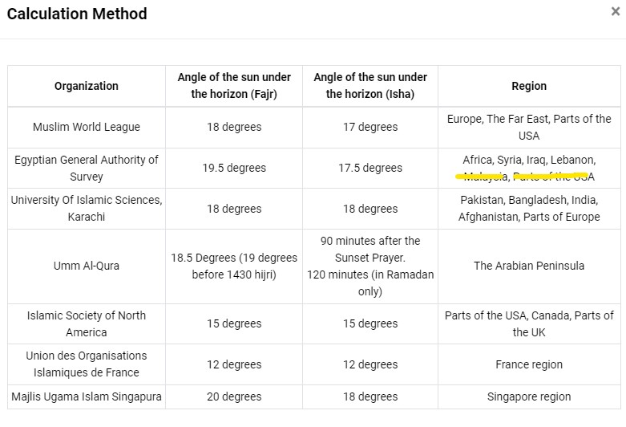
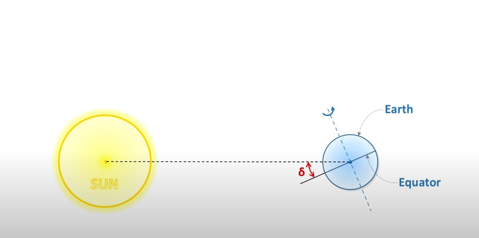

## Prayer Times

### Pendahuluan
Dalam penentuan waktu sholat di Qur'an Belajar, sebaiknya dipakai rules yaitu:
1. Jika di satu region ada lembaga yang memiliki otoritas untuk mengeluarkan waktu sholat, dan jadwal sholat dapat diakses/didapat daftar/ada API-nya, maka jadwal dari lembaga tersebut yang akan dipakai. Daftarnya adalah sebagai berikut:
    - wilayah Indonesia: SIHAT KEMENAG
    - Malaysia: JAKIM
    - Brunei: 
    - Singapore: Majelis Ugama Islam Singapura
    - Ummul Quro (khusunya mekkah dan madinah)
    - Greater London (ada publikasi dalam bentuk pdf)

Di bawah ini adalah daftar kalkulasi waktu sholat dari sumber [islamicFInder](https://islamicfinder.org)

### Penghitungan Sun declination

sumber [video youtube](https://www.youtube.com/watch?v=ZALVBxzmPIk)

pengamatan sun declination.

Untuk menghitung sun declination:
")